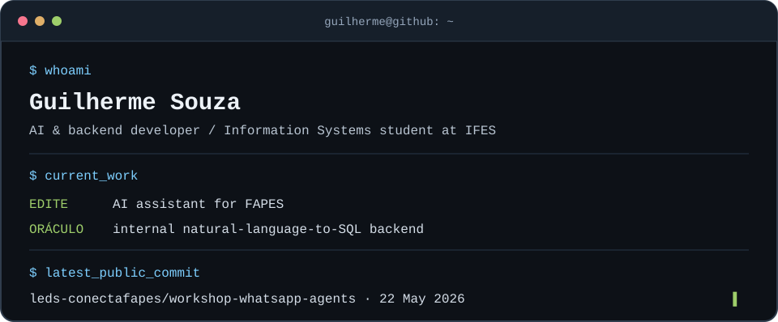

I'm pursuing a bachelor's degree in Information Systems at IFES and working with AI agents and backend development at [LEDS](https://github.com/leds-conectafapes). I contribute to **EDITE**, an AI assistant for FAPES, and to the backend of **Oráculo**, an internal natural-language-to-SQL tool for FAPES. Most of this work happens in private organization repositories.

### Selected work

- **[plan-bot](https://github.com/Ilhe8l/plan-bot)** — Discord-based AI agents that turn backlogs into sprint plans and GitHub issues.
- **[multi-agent-orchestrator](https://github.com/Ilhe8l/multi-agent-orchestrator)** — LangGraph orchestration for specialized agents behind a FastAPI service.
- **[workshop-whatsapp-agents](https://github.com/leds-conectafapes/workshop-whatsapp-agents)** — Workshop materials on LangGraph agents and the WhatsApp Cloud API, with notebooks, tools, memory, and webhook examples.

Contact: [email](mailto:guilhermesouza.box@gmail.com) · [LinkedIn](https://www.linkedin.com/in/guilherme8l/)
