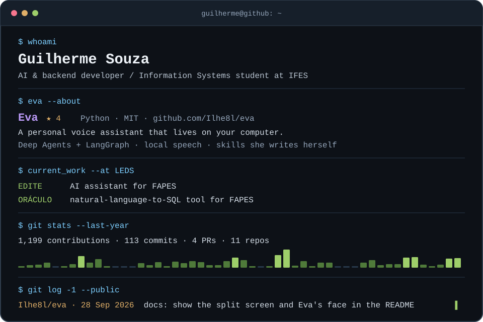

I'm pursuing a bachelor's degree in Information Systems at IFES and working with AI agents and backend development at [LEDS](https://github.com/leds-conectafapes).

### Eva

**[Eva](https://github.com/Ilhe8l/eva)** is my personal voice assistant, and it runs entirely on my own computer. It's built on Deep Agents and LangGraph, uses faster-whisper to listen and Kokoro to speak, and asks before doing anything with side effects. When she can't do something yet, she writes a skill for it. She's named after EVE (EVA in Brazil) from WALL-E.

### At LEDS

I contribute to **EDITE**, an AI assistant for FAPES, and to the backend of **Oráculo**, an internal natural-language-to-SQL tool for FAPES. Most of this work lives in private organization repositories.

### Other projects

- **[plan-bot](https://github.com/Ilhe8l/plan-bot)**: Discord-based AI agents that turn backlogs into sprint plans and GitHub issues.
- **[multi-agent-orchestrator](https://github.com/Ilhe8l/multi-agent-orchestrator)**: LangGraph orchestration for specialized agents behind a FastAPI service.
- **[langfuse-api](https://github.com/Ilhe8l/langfuse-api)**: cost, token and latency metrics from Langfuse, with background processing and Redis caching.
- **[workshop-whatsapp-agents](https://github.com/leds-conectafapes/workshop-whatsapp-agents)**: workshop materials on LangGraph agents and the WhatsApp Cloud API.

Contact: [email](mailto:guilhermesouza.box@gmail.com) · [LinkedIn](https://www.linkedin.com/in/guilherme8l/)
